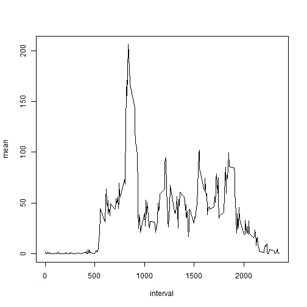

# Reproducible Research: Peer Assessment 1


## Loading and preprocessing the data

```r
raw.data <- read.csv("activity.csv", colClasses = c("integer", "Date", "integer"))
dates = unique(raw.data$date)
intervals = unique(raw.data$interval)
```


## What is mean total number of steps taken per day?

```r
clean.date.sums <- as.integer()
i <- 0
for(i in 1:length(dates)){
  working.steps <- subset(raw.data, date==dates[i], select = steps)
  clean.date.sums[i] <- sum(working.steps$steps, na.rm=TRUE)
}
clean.date.sums <- cbind.data.frame(dates,clean.date.sums)
colnames(clean.date.sums) <- c("date","total")
```
Histogram:

```r
hist(clean.date.sums$total)
```

 

Mean and Median:

```r
daily.mean = mean(clean.date.sums$total, na.rm = TRUE)
daily.median = median(clean.date.sums$total, na.rm = TRUE)
```
The mean is 9354.2295 and the median is 10395

## What is the average daily activity pattern?

Time Series:

```r
clean.interval.means <- as.numeric()
i <- 0
for(i in 1:length(intervals)){
  working.steps <- subset(raw.data, interval==intervals[i], select = steps)
  clean.interval.means[i] <- mean(working.steps$steps, na.rm=TRUE)
}
clean.interval.means <- cbind(intervals,clean.interval.means)
colnames(clean.interval.means) <- c("interval", "mean")
max.interval <- clean.interval.means[which.max(clean.interval.means[,2])]
plot(clean.interval.means, type = "l")
```

 

The interval with the maximum number of steps is 835

## Imputing missing values

```r
total.na <- length(which(is.na(raw.data$steps)))
```
The total number of NA's in the raw dataset is 2304 

The missing values will be filled using the rounded interval mean for a missing data point. The new dataset is called simulated.data.


```r
simulated.data <- raw.data
observations <- length(simulated.data[,1])

i <- 0
for(i in 1:observations){
  if(is.na(simulated.data[i,1])){
    working.interval = simulated.data[i,3]
    simulated.data$steps[i] = 
      as.integer(round(clean.interval.means[(which(intervals == working.interval)),2], digits = 0))
  }
}
```

Histogram:


```r
simulated.date.sums <- as.integer()
i <- 0
for(i in 1:length(dates)){
  working.steps <- subset(simulated.data, date==dates[i], select = steps)
  simulated.date.sums[i] <- sum(working.steps$steps, na.rm=TRUE)
}
simulated.date.sums <- cbind.data.frame(dates,simulated.date.sums)
colnames(simulated.date.sums) <- c("date","total")
daily.mean.simulated = mean(simulated.date.sums$total, na.rm = TRUE)
daily.median.simulated = median(simulated.date.sums$total, na.rm = TRUE)
hist(simulated.date.sums$total)
```

 

For the simulated dataset, the mean is 1.0766 &times; 10<sup>4</sup> and the median is 10762. By adding the simulated values the mean and median have drifted higher.


## Are there differences in activity patterns between weekdays and weekends?
Weekend Data:

```r
i <- 0
weekday.value <- as.character()
for(i in 1:observations){
  weekday.value[i] <- weekdays(simulated.data$date[i], abbreviate=TRUE)
}
simulated.data <- cbind.data.frame(simulated.data,weekday.value)
simulated.data.weekend <- subset(simulated.data, weekday.value == c("Sat", "Sun"))
weekend.interval.means <- as.numeric()
i <- 0
for(i in 1:length(intervals)){
  working.steps <- subset(simulated.data.weekend, interval==intervals[i], select = steps)
  weekend.interval.means[i] <- mean(working.steps$steps, na.rm=TRUE)
}
weekend.interval.means <- cbind(intervals,weekend.interval.means)
colnames(weekend.interval.means) <- c("interval", "mean")
```

Workweek Data:

```r
simulated.data.mon <- subset(simulated.data, weekday.value == "Mon")
simulated.data.tue <- subset(simulated.data, weekday.value == "Tue")
simulated.data.wed <- subset(simulated.data, weekday.value == "Wed")
simulated.data.thu <- subset(simulated.data, weekday.value == "Thu")
simulated.data.fri <- subset(simulated.data, weekday.value == "Fri")
simulated.data.workweek <- rbind(simulated.data.mon,simulated.data.tue,simulated.data.wed,simulated.data.thu,simulated.data.fri)
workweek.interval.means <- as.numeric()
i <- 0
for(i in 1:length(intervals)){
  working.steps <- subset(simulated.data.workweek, interval==intervals[i], select = steps)
  workweek.interval.means[i] <- mean(working.steps$steps, na.rm=TRUE)
}
workweek.interval.means <- cbind(intervals,workweek.interval.means)
colnames(workweek.interval.means) <- c("interval", "mean")
```

Panel Plot:

```r
library(fields)
```

```
## Loading required package: spam
## Loading required package: grid
## Spam version 0.41-0 (2014-02-26) is loaded.
## Type 'help( Spam)' or 'demo( spam)' for a short introduction 
## and overview of this package.
## Help for individual functions is also obtained by adding the
## suffix '.spam' to the function name, e.g. 'help( chol.spam)'.
## 
## Attaching package: 'spam'
## 
## The following objects are masked from 'package:base':
## 
##     backsolve, forwardsolve
## 
## Loading required package: maps
```

```r
set.panel(2,1)
```

```
## plot window will lay out plots in a 2 by 1 matrix
```

```r
plot(weekend.interval.means, type = "l")
plot(workweek.interval.means, type = "l")
```

 
